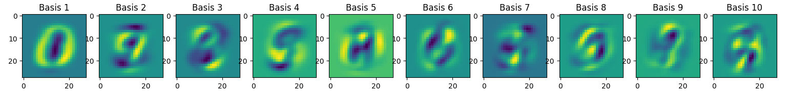
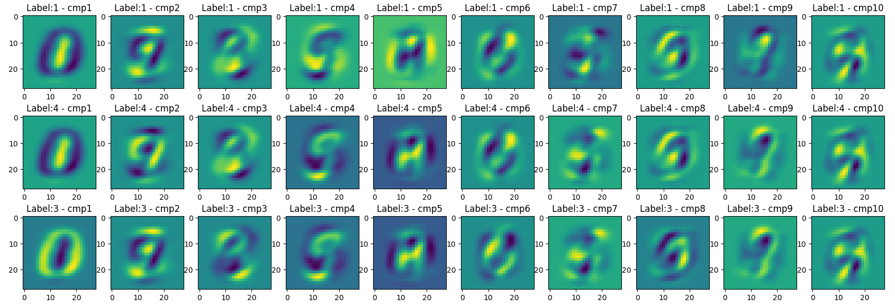
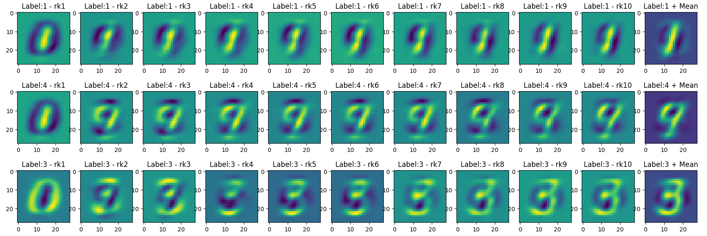
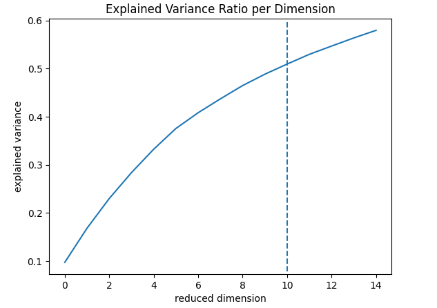

# Analysis

This document summarizes the results of application PCA to MNIST.

In this analysis, the data dimension is reduced from 784 to 10.

Data labeled 1, 3, 4 were used for this analysis. (MNIST train dataset index: 59498, 10679, 35143)

## 1. Principal Components Visualization

### Observation:
- Each component captures the direction of pixel variation.
- First component represents whether shape is round or straight
- Second and third component represent whether shape resembles the specific number(*'9'*, and *'3'*)

### Interpretation:
- PCA captures the largest global variations in pixel space.
- The largest variation of MNIST is roundness or straightness.

## 2. PCA Projection

### Observation:
- 1-labeled and 4-labeled have similar direction in first and third component, while 1-labeled and 3-labeled have similar direction in second component

### Interpretation:
- 1-labeled has 'straight bar' direction in first component, and it fits common sense
- 4-labeled has  'shape of number 9' direction in second component. Considering number 4 resembles to number 9, it is acceptable.
- 3-labeled has 'shape of number 3' direction in third component, as we expected.

## 3. Reconstruction

### Observation:
- 1-labeled data reconstructs its overall shape in first component.
- 4-labeled data reconstructs its overall shape in second component.
- 3-labeled data reconstructs its overall shape in third component.

### Interpretation:
- MNIST dataset can recover its original information only with few principal components.

## 4. Explained Variance Ratio

### Obseravation:
- The more dimension, the more explainable variance.
- Growth rate decreases as the dimension increases.

### Interpretation:
- Prior principal directions explains more variance than post directions
- Approximately 50% of variance can be explained even with only 1.2% of original dimension

